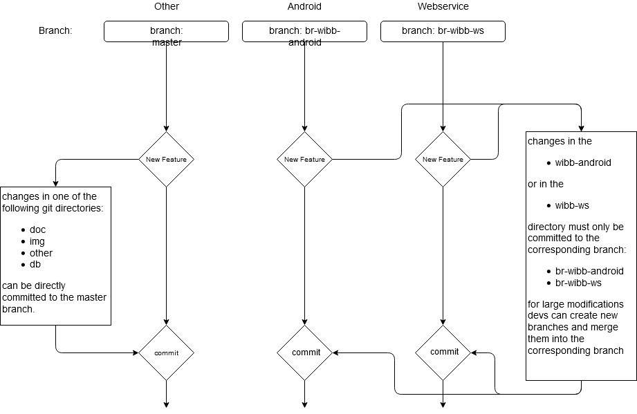

# wibb documentation & dev guidelines

This figure illustrates the basic idea and a rough mockup of the *wibb* UI:

## Git
Here you can find information about any *Git* guidelines used in *wibb*.

### Basic rules:

* **Always** include a `.gitignore` file for project directories that could contain build files.

* Try to add an appropriate commit message when committing changes

* **Avoid** committing files to wrong folders in wrong branches (see Git workflow)

### Git workflow:
There are three branches used in the *wibb* project:
* `master`
* `br-wibb-android`
* `br-wibb-ws`

These branches must be used according to the following figure:

in other words: changes to one of the main folders have to be committed to the corresponding branch like shown in this table:

| Folder       | commit to Branch |
|--------------|------------------|
| doc          | master           |
| img          | master           |
| other        | master           |
| wibb-android | br-wibb-android  |
| wibb-ws      | br-wibb-ws       |
| wibb-db      | master           |

Also: do not commit changes in folders that do not belong to the branch! this can mess up version control for others! (e.g. only commit changes to the `wibb-android` folder to the `br-wibb-android` branch)
